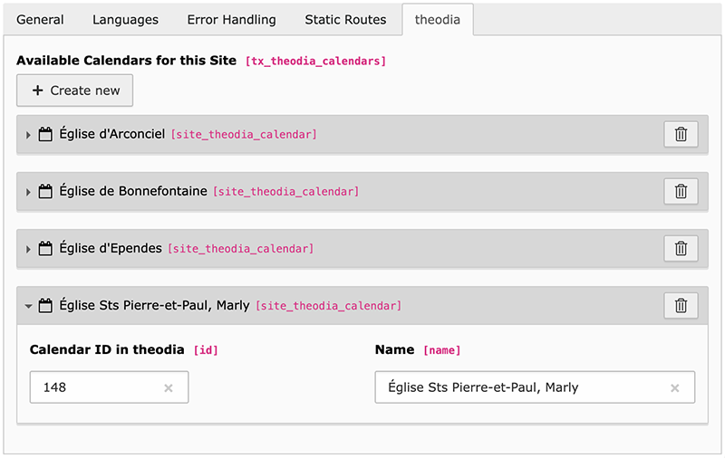

.. include:: ../Includes.rst.txt
.. _configuration:

Configuration
=============

In order to use this extension, you must configure which places of worship you
intend to use. This is done by editing your site configuration
(stored in :file:`config/sites/<site>/config.yaml`), and adding a list of
theodia calendars.

The easiest way to do this is to use the site configuration editor in the
Backend, which will automatically add the correct configuration for you. To do
so, go to the Backend, and click on Site Management > Sites, then click on the
pencil to edit your website and go to the "theodia" tab:

Each calendar you want to use is of the form ``<id>, <name>`` where ``<id>`` is
the ID of the calendar in theodia.

A sample configuration could be::

   148, Église Sts Pierre-et-Paul, Marly
   150, Église de Praroman, Le Mouret

You can find the ID of a calendar by searching it on
https://theodia.org/en/widget, selecting it in the list, and looking at the
generated code snippet.

This mapping is used to generate the list of available calendars to be used with
the plugin:

.. image:: Images/plugin-calendars.png
   :alt: List of calendars to show in a given plugin
