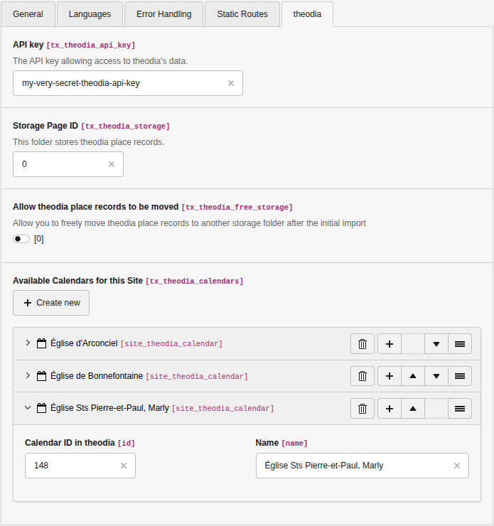

.. include:: ../Includes.rst.txt
.. _configuration:

Configuration
=============

In order to use this extension, you must configure an API key, and which places
of worship you intend to use. This is done by editing your site configuration
(stored in :file:`config/sites/<site>/config.yaml`), adding the API key that you
obtained via https://about.theodia.org/api, and adding a list of THEODIA
calendars.

The easiest way to do this is to use the site configuration editor in the
Backend, which will automatically add the correct configuration for you. To do
so, go to the Backend and then:

- Open Site Management > Sites
- Find the site you want to configure and click the pencil icon to edit it
- Go to the "THEODIA" tab
- Add a "record" for each calendar you want to use in this site.

You can find the ID of a calendar by searching it on
https://theodia.org/en/widget, selecting it in the list, and looking at the
generated code snippet.

.. note::

   A few examples to help you get started:

   - Église Sts Pierre-et-Paul, Marly (id = ``148``)
   - Église de Praroman, Le Mouret (id = ``150``)

These definitions are then used to generate the list of available calendars to
be used with :ref:`the plugin <usage>`:

.. image:: ../Usage/Images/plugin-calendars.png
   :alt: List of calendars to show in a given plugin

.. hint::

   The order in which you configure your different THEODIA calendars has no
   effect whatsoever on the order in which the calendars are presented in the
   plugin. The plugin automatically sorts the available calendars in
   alphabetical order.

   If, for the sake of Swissness, you want to order the calendars in the Site
   Configuration, you may do with the corresponding controls on the right.

.. _configuration-typoscript:

Configuration in TypoScript
---------------------------

You should also configure the extension in TypoScript. You can do so like that:

1. Open the Template module within the Web section.
2. Select your root page template (usually the one with the world icon).
3. Make sure you are on the "Info/Modify" view (top selector).
4. Click on the button "Edit the whole template record".
5. Switch to tab "Includes".
6. Include "THEODIA (theodia)" within the "Include static (from extensions)"
   section.

Alternatively if you are using a Site package, you can add the following to
your :file:`Configuration/TypoScript/constants.typoscript` file (or alike):

.. code-block:: typoscript

   @import 'EXT:theodia/Configuration/TypoScript/constants.typoscript'

and in your :file:`Configuration/TypoScript/setup.typoscript` file (or alike):

.. code-block:: typoscript

   @import 'EXT:theodia/Configuration/TypoScript/setup.typoscript'

then adapt the configuration to your needs (you may use the built-in Constant
Editor to guide you).

.. _configuration-typoscript-constants:

Constants
^^^^^^^^^

Any constant needs to be prefixed with
:typoscript:`plugin.tx_theodia.settings.`.

.. only:: html

   .. contents:: Properties
      :depth: 1
      :local:

.. _tsEventDateFormat:

eventDateFormat
"""""""""""""""

.. confval:: eventDateFormat

   :type: string
   :Default: %A %e %B %Y
   :Path: plugin.tx_theodia.settings

   Format of the dates in the event list. The default value will show, e.g.,
   Monday 25 December 2023 (localized to the language you use).

   Format of the string is either a
   `strftime() format string <https://www.php.net/manual/en/function.strftime.php>`__
   (localized) or a
   `date() format string <https://www.php.net/manual/en/datetime.format.php>`__
   (English/numeric only).

.. _tsEventTimeFormat:

eventTimeFormat
"""""""""""""""

.. confval:: eventTimeFormat

   :type: string
   :Default: H:i
   :Path: plugin.tx_theodia.settings

   Format of the times in the event list. Typically use ``H:i`` for 24h format
   (e.g. 08:30 or 17:00) or ``g:i a`` for 12h format (e.g., 8:30 AM or 5:00 PM).

.. _tsCssIframe:

cssIframe
"""""""""

.. confval:: cssIframe

   :type: string
   :Default: EXT:theodia/Resources/Public/Css/iframe.css
   :Path: plugin.tx_theodia.settings

   Path to a custom CSS when :ref:`using an iframe <pluginIframe>` to list
   events.
