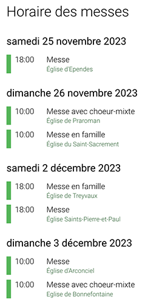

.. include:: ../Includes.rst.txt
.. _introduction:

Introduction
============

This extension provides a few plugins to display the Mass schedule for the
various places of worship in a parish or pastoral unit.

`theodia.org <https://theodia.org>`__ has been tailor-made to meet the needs of
the Catholic Church, from religious communities to parishes and dioceses. This
tool is used to share Catholic mass times and has been designed and developed to
be extended to several countries.

In this context, parishes and pastoral units are invited to enter the times of
their Catholic celebrations in the form of ICS feeds (e.g., Google Calendar) or
in a structured way on their website so that they can be easily added to
THEODIA.

.. _what-it-does:

What does it do?
----------------

Webmasters can easily add a THEODIA widget (JavaScript) to their site to display
the Mass schedule for one or more locations or according to certain criteria
(e.g., Masses in a particular language).

The extension goes one step further by providing a few plugins to integrate that
source of information directly into the TYPO3 website; thus allowing enhanced
integration and much more flexibility such as the possibility to deep-link to
custom pages for the various locations.

.. _screenshots:

Screenshots
-----------

.. _requirements:

Requirements
------------

This extension requires TYPO3 11 LTS or later, and a valid API key from
https://about.theodia.org/api.

.. _sponsors:

Sponsors
--------

This extension has been initially developed in May 2020 by
`Causal Sàrl <https://www.causal.ch>`__ for the
`Pastoral Unit Sainte-Claire <https://www.paroisse.ch>`__ in canton Fribourg
(CH), and is now further maintained by the same company and other contributors.

Since end of 2023, the extension is sponsored partly as well by the web agency
`hemmer <https://www.hemmer.ch>`__, the company behind theodia.org.

.. _support:

Support
-------

In case you need help to configure this extension, please ask for free support
in `TYPO3 Slack <https://typo3.slack.com/>`_ or contact the maintainer for paid
support.
