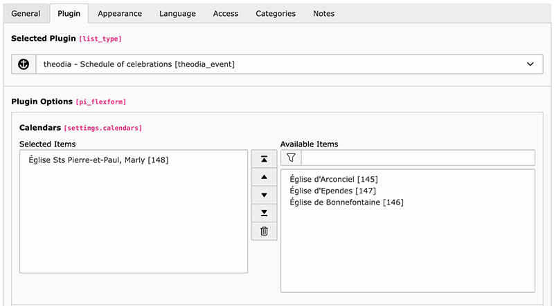

.. _usage:

Usage
=====

This chapter describes how to take advantage of this extension from the user's
point of view.

In order to show upcoming events in your website, need need to add a plugin to
a page:

The plugin will show a list of calendars to choose from. You can select one or
more calendars to show in the plugin. Showing multiple calendars is useful if
you put the plugin on some homepage where all events from all your various
places of worship should be presented.

.. note::

   If you miss some place of worship, you will need to adapt the mapping as
   described in chapter :ref:`configuration`.

Events are related to a location (or place of worship). Upon first encounter,
this extension will automatically create a new place of worship when it
encounters a new one in the calendar. Those places are fetched from theodia and
stored in the storage folder you defined in your Site Configuration. Once
imported, you may edit it freely.

.. _usage-settings:

Settings
--------

Any setting needs to be prefixed with :typoscript:`plugin.tx_theodia.settings.`
if you want to configure the plugin purely in TypoScript.

.. only:: html

   .. contents:: Settings
      :depth: 1
      :local:

.. _pluginNumberOfEvents:

Number of events to display
"""""""""""""""""""""""""""

.. confval:: numberOfEvents

   :type: int
   :Default: 10
   :Path: plugin.tx_theodia.settings

   Number of future events to show with the plugin. If the calendar contains
   more events, they will be ignored and begin to show up once older events are
   removed as time goes by.

.. _pluginShowLocation:

Show place of worship
"""""""""""""""""""""

.. confval:: showLocation

   :type: bool
   :Default: 0
   :Path: plugin.tx_theodia.settings

   Whether the location of the event should be made visible. Please note that
   actual display may change if the default templates are overridden. This is
   particularly useful to show the location if you select more than one calendar
   for the plugin.

.. _pluginFilter:

Filter
""""""

.. confval:: filter

   :type: string
   :Default: *empty string*
   :Path: plugin.tx_theodia.settings

   This is a
   `regular expression <https://www.php.net/manual/en/pcre.pattern.php>`__ that
   lets you filter the events that are shown. For example, if you want to show
   only events that are related to a mass for families, you could select all
   calendars and use the following filter::

      /famil(y|ies)/i

   This will show all events, in any place of worship, that contain the word
   "family" or "families" in their title (case insensitive).

   Another typical example (in French) is to show only events were the parish's
   choir is involved::

      /ch(oe|œ)ur[ -]+mixte/i

.. _pluginIframe:

Use an iframe block
"""""""""""""""""""

.. confval:: iframe

   :type: bool
   :Default: 0
   :Path: plugin.tx_theodia.settings

   This generates a standard iframe block instead of a list of events, just as
   you would do on your own when you embed the default JS-based
   `widget from THEODIA <https://theodia.org/en/widget>`__.

   Many options may be passed as parameter but the whole point of using this
   TYPO3 extension is to be much more flexible and better in term of SEO than
   the standard widget, so this option is not recommended and only basic options
   are selected. You can adapt :ref:`the default CSS <tsCssIframe>` to your
   needs though.
